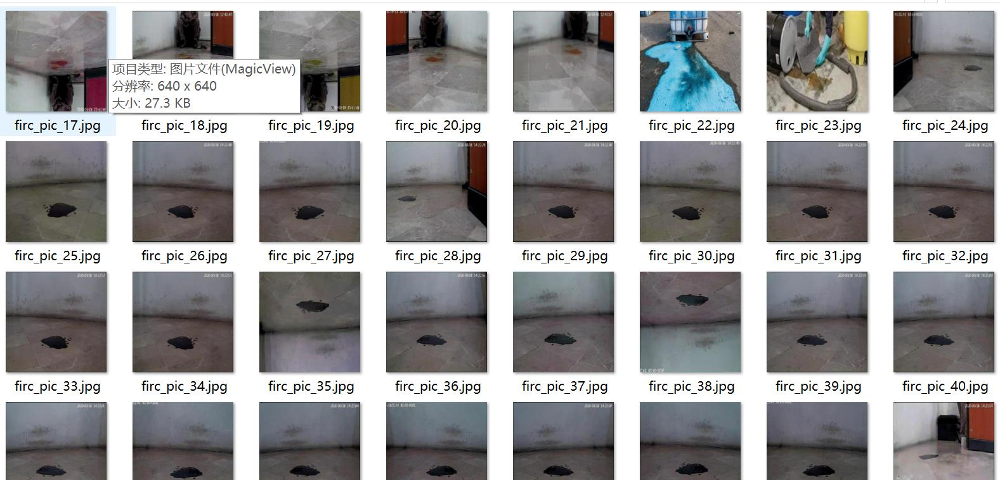
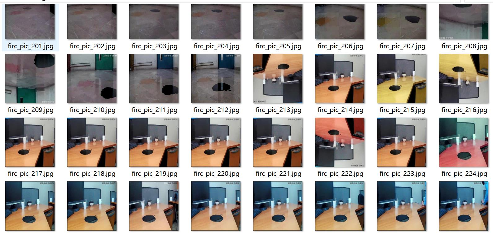
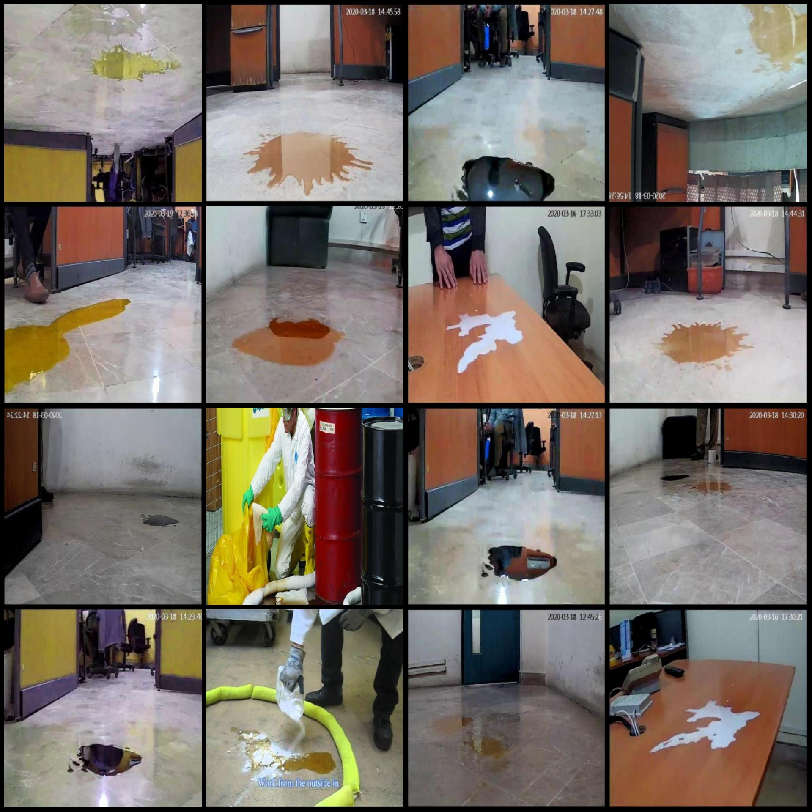
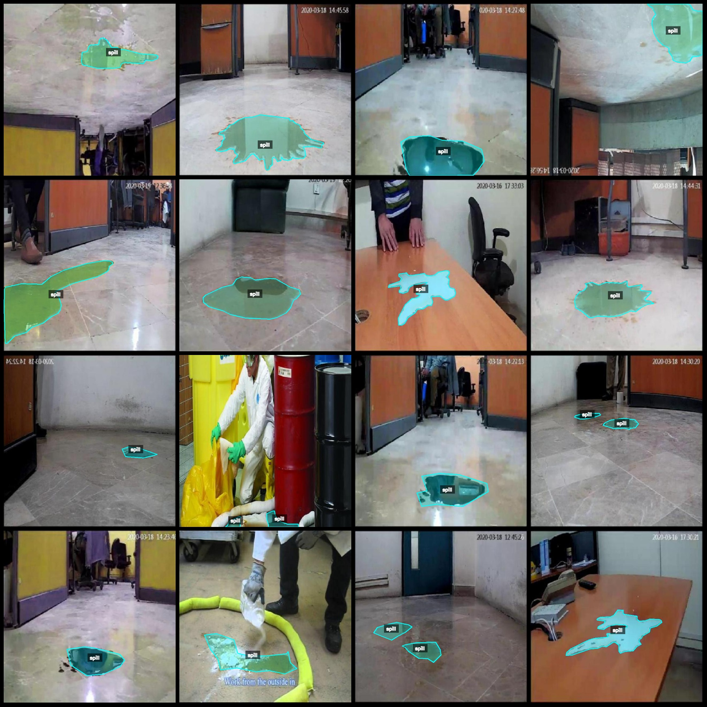
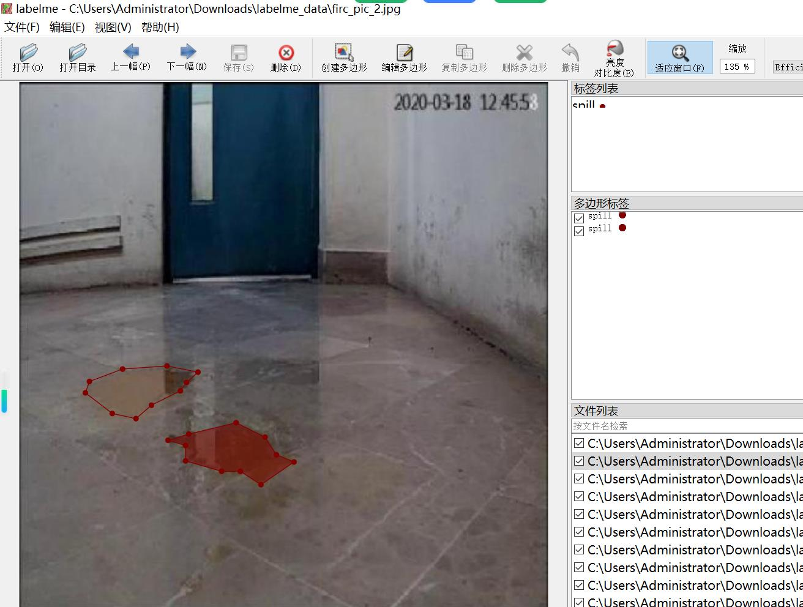

# Liquid Spill Oil and Water Leakage Identification and Segmentation Dataset - LabelMe Format: 1202 Images, 1 Category

Dataset Format: LabelMe format (excluding mask files, only including JPG images and corresponding JSON files)
Number of Images: 1202
Number of Annotations: 1202
Number of Categories: 1
Annotation Category Name: "spill"
Number of Boxes per Category: 1430
Total Boxes: 1430
LabelMe Tool Used: labelme=5.5.0
Image Resolution: 640x640
Annotation Rules: Polygon boxes are drawn around the categories
Important Notice: The dataset can be edited using LabelMe, but JSON datasets must be converted into either Yolo or COCO format for semantic segmentation or instance segmentation.
Special Note: This dataset does not guarantee the accuracy of the trained models or weight files.
Example Images:
Randomly selected 16 images:
Annotation drawing results:
LabelMe editing example image:

## Images

Here is a pay link on Stripe ( https://buy.stripe.com/3cs8yP7sY87d0vu9AB ). Please contact me lonlonago@foxmail.com after funding $89, and I will send you a complete data files , thank you!

